# Maintenance Prédictive par IA Embarquée sur STM32L4R9

## Table des matières

1. [Contexte et objectif](#1-contexte-et-objectif)
2. [Structure du dépôt](#2-structure-du-dépôt)
3. [Installation et utilisation](#3-installation-et-utilisation)
4. [Analyse du dataset](#4-analyse-du-dataset-ai4i-2020)
5. [Premier modèle : sans rééquilibrage](#5-premier-modèle--sans-rééquilibrage)
6. [Deuxième modèle : avec SMOTE](#6-deuxième-modèle--avec-smote)
7. [Export et conversion du modèle](#7-export-et-conversion-du-modèle)
8. [Déploiement sur STM32L4R9](#8-déploiement-sur-stm32l4r9)
9. [Résultats de l'inférence embarquée](#9-résultats-de-linférence-embarquée)
10. [Problèmes rencontrés et bugs](#10-problèmes-rencontrés-et-bugs)
11. [Limites du projet](#11-limites-du-projet)
12. [Conclusion et pistes d'amélioration](#12-conclusion-et-pistes-damélioration)
13. [Bonus : reconnaissance de chiffres MNIST sur écran tactile](#13-bonus--reconnaissance-de-chiffres-mnist-sur-écran-tactile)

---

## 1. Contexte et objectif

En industrie, on a généralement trois façons de gérer la maintenance d'une machine : attendre qu'elle casse (maintenance corrective, coûteux et potentiellement dangereux), la réviser à intervalles fixes (maintenance préventive, on remplace des pièces qui auraient pu durer encore longtemps), ou analyser les données de ses capteurs pour détecter les signes avant-coureurs d'une panne et intervenir au bon moment (maintenance prédictive). C'est cette troisième approche qu'on met en oeuvre ici.

L'idée du projet, c'est de prendre un dataset de capteurs industriels (températures, couple, vitesse de rotation, usure d'outil), d'entraîner un réseau de neurones à classifier l'état d'une machine parmi 5 catégories (fonctionnelle + 4 types de pannes), puis de déployer ce modèle sur un microcontrôleur STM32L4R9. 

Ce déploiement sert à montrer que l'inférence tourne en embarqué, avec 23 Ko de Flash et 2.8 Ko de RAM, via l'outil X-CUBE-AI de STMicroelectronics.

Le schéma ci-dessous résume le pipeline complet du projet, du dataset brut jusqu'au test d'inférence sur cible :


---

## 2. Structure du dépôt

```
Projet_Maintenance_Predictive/
│
├── notebook/
│   └── TP_IA_EMBARQUEE.ipynb      # Notebook principal : analyse, entraînement, export
│
├── data/
│   └── ai4i2020.csv               # Dataset AI4I 2020 (10 000 échantillons)
│
├── modele/
│   ├── modele_maintenance.tflite   # Modèle entraîné, prêt à déployer (15.6 KB)
│   ├── x_test.npy                  # Données de test (1996 × 8 features normalisées)
│   └── y_test.npy                  # Labels one-hot (1996 × 5 classes)
│
├── scripts/
│   └── communication.py            # Script UART pour tester l'inférence sur cible
│
├── stm32/
│   ├── AI4I2020/                   # Projet STM32CubeIDE complet
│   │   ├── Core/Src/main.c         # Initialisation carte (UART, horloges, etc.)
│   │   ├── X-CUBE-AI/App/
│   │   │   └── app_x-cube-ai.c    # Code utilisateur : réception UART + inférence + envoi
│   │   └── AI4I2020.ioc            # Configuration CubeMX (périphériques, X-CUBE-AI)
│   ├── rapport-analyse.txt         # Rapport d'analyse mémoire du modèle
│   └── rapport-validation-desktop.txt  # Rapport de validation desktop (cross-accuracy)
│
├── bonus/
│   ├── CNN_C2_16_10/               # Modèle MNIST du prof (notebook, .h5, données test)
│   ├── MnistNetwork/               # Projet CubeMX avec X-CUBE-AI configuré pour MNIST
│   └── MnistTouchscreen/           # Projet final : dessin tactile + inférence (voir section 13)
│
├── images/                         # Graphiques et captures d'écran pour ce README
├── requirements.txt                # Dépendances Python
└── README.md                       # Ce fichier
```

**Fichiers clés à regarder en priorité :**
- Le notebook `notebook/TP_IA_EMBARQUEE.ipynb` contient toute la logique d'entraînement, de l'analyse des données à l'export du modèle.
- Le fichier `stm32/AI4I2020/X-CUBE-AI/App/app_x-cube-ai.c` contient le code que j'ai écrit pour faire communiquer la carte avec le PC et lancer l'inférence.
- Le script `scripts/communication.py` est ce qu'on exécute côté PC pour envoyer les données de test et récupérer les prédictions.

---

## 3. Installation et utilisation

### Prérequis

- Python 3.10+
- STM32CubeIDE (pour compiler et flasher le firmware)
- X-CUBE-AI v10.x (installé via le gestionnaire de packs dans CubeMX)
- Une carte STM32L4R9I-Discovery branchée en USB via le ST-Link

### Installation des dépendances Python

```bash
pip install -r requirements.txt
```

### Reproduire l'entraînement

Ouvrir `notebook/TP_IA_EMBARQUEE.ipynb` et exécuter toutes les cellules. Le notebook va :
1. Charger et analyser le dataset `data/ai4i2020.csv`
2. Entraîner deux modèles (avec et sans SMOTE)
3. Exporter le modèle final en `.tflite` dans `modele/`
4. Sauvegarder les données de test (`x_test.npy`, `y_test.npy`)

### Compiler et flasher le firmware

1. Ouvrir le projet `stm32/AI4I2020/` dans STM32CubeIDE
2. Build (Ctrl+B)
3. Flash via le ST-Link (Run → Debug ou Run)

### Tester l'inférence sur cible

Une fois le firmware flashé et la carte branchée :

```bash
python scripts/communication.py
```

Le script va se synchroniser avec la carte, envoyer les 1996 échantillons de test un par un, et afficher l'accuracy finale. Il faut vérifier que le port COM est le bon (par défaut `COM3`, visible dans le Gestionnaire de périphériques Windows sous "Ports (COM et LPT)").

---

## 4. Analyse du dataset AI4I 2020

Le dataset utilisé est le [AI4I 2020 Predictive Maintenance Dataset](https://archive.ics.uci.edu/ml/datasets/AI4I+2020+Predictive+Maintenance+Dataset). Il contient 10 000 échantillons de données de capteurs industriels simulés. Chaque ligne représente l'état d'une machine à un instant donné, avec des mesures physiques (températures, vitesse de rotation, couple, usure de l'outil) et des étiquettes indiquant si une panne est survenue, et de quel type.

### Déséquilibre des classes

Le premier truc qu'on remarque quand on regarde les données, c'est que la très grande majorité des machines fonctionnent normalement : environ 96.6% sont étiquetées "No Failure", et seulement 3.4% sont en panne.


Ce déséquilibre est tout à fait réaliste (heureusement qu'il y a plus de machines qui marchent que de machines cassées), mais ça pose un vrai problème pour l'entraînement. Un modèle peut très bien atteindre 96.6% d'accuracy en répondant systématiquement "pas de panne" à tout, sans avoir rien compris aux données. C'est exactement ce qui va se passer avec le premier modèle, on le verra plus bas.

### Types de pannes

Parmi les machines en panne, on distingue 5 types de défaillance :

| Sigle | Type de panne | Description |
|-------|--------------|-------------|
| TWF | Tool Wear Failure | Usure de l'outil |
| HDF | Heat Dissipation Failure | Dissipation thermique insuffisante |
| PWF | Power Failure | Panne liée à la puissance |
| OSF | Overstrain Failure | Surcharge mécanique |
| RNF | Random Failure | Panne aléatoire |


HDF et OSF sont les plus fréquents. TWF est déjà assez rare. Et RNF ne compte que 19 occurrences sur 10 000 lignes. Avec si peu d'exemples, aucun modèle ne pourra apprendre quelque chose de fiable pour cette classe. J'ai donc fait le choix de retirer RNF des sorties du modèle : on ne cherche pas à la prédire.

### Choix des entrées et sorties

J'ai pas mal réfléchi à ce qu'il fallait donner en entrée au modèle. Les 5 mesures capteurs brutes (Air temperature, Process temperature, Rotational speed, Torque, Tool wear) sont un bon point de départ, mais en regardant les corrélations dans les données, j'ai ajouté deux features calculées :

**8 entrées au total :**
- Les 5 mesures capteurs directes
- Le type de machine (encodé numériquement : L=0, M=1, H=2)
- `Power = Torque × Rotational speed` — corrélé aux pannes OSF et PWF, ce qui est logique physiquement (une puissance anormale signale une surcharge ou un problème électrique)
- `delta_T = Process temperature - Air temperature` — un bon indicateur pour HDF puisque c'est directement lié à la dissipation thermique

**5 sorties (softmax) :** Functional, TWF, HDF, PWF, OSF.

Le choix du **softmax** plutôt que des sigmoïdes indépendantes (approche multi-label) vient d'une observation dans les données : les pannes simultanées sont très rares, moins de 5% des cas de panne. Avec un softmax, le modèle est forcé de choisir une seule classe, ce qui simplifie l'apprentissage et donne des probabilités plus tranchées en sortie. En contrepartie, on perd la capacité de détecter les cas rares où deux pannes surviennent en même temps, mais c'est un compromis qui m'a semblé raisonnable vu les données.

---

## 5. Premier modèle : sans rééquilibrage

### Architecture

Pour le premier essai, j'ai utilisé une architecture assez classique de MLP (Multi-Layer Perceptron) :

| Couche | Neurones | Activation | Dropout |
|--------|----------|------------|---------|
| Dense 1 | 64 | ReLU | 0.15 |
| Dense 2 | 32 | ReLU | 0.15 |
| Dense 3 | 16 | ReLU | - |
| Sortie | 5 | Softmax | - |

L'architecture est compacte, et c'est voulu. D'une part, le modèle doit tourner sur un microcontrôleur avec des ressources limitées. D'autre part, on ne classifie que 8 features, il n'y a pas besoin d'un réseau à 100 000 paramètres pour ça. J'ai quand même ajouté 3 couches cachées au lieu de 2 (certains projets se contentent de Input → 64 → Sortie) parce que ça permettait de mieux séparer HDF de PWF, qui ont des signatures assez proches dans les données.

Le dropout à 0.15 est volontairement léger. Avec un réseau aussi petit, un dropout trop agressif (genre 0.4 ou 0.5) empêchait le modèle de converger correctement. C'est quelque chose que j'ai constaté en testant : à 0.3, l'accuracy de validation oscillait pas mal et les courbes de loss étaient instables. À 0.15, le modèle apprenait de façon plus régulière.

### Résultats

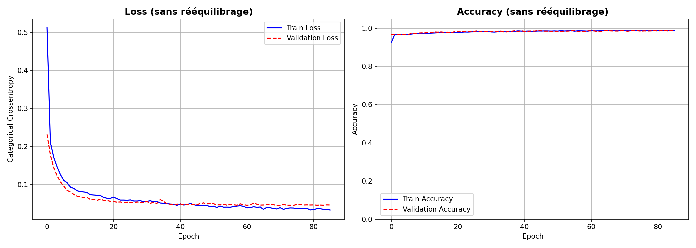

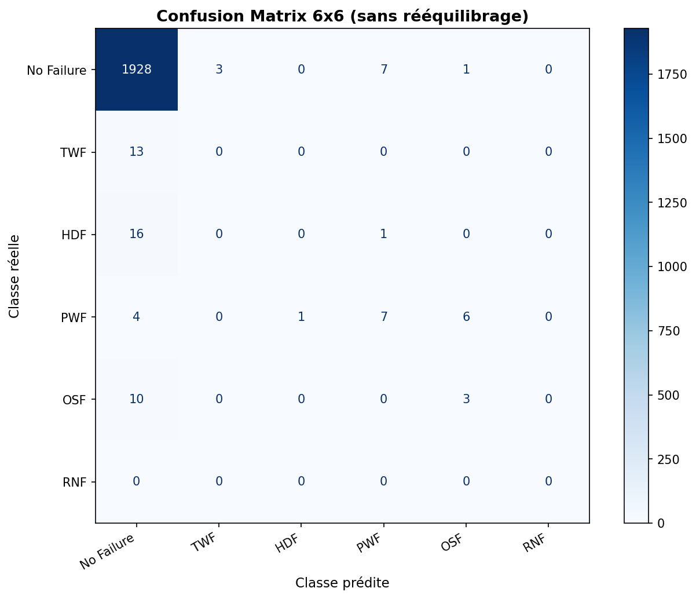

L'accuracy atteint 99%. Sur le papier c'est excellent. En réalité c'est trompeur. Le modèle classe correctement presque toutes les machines fonctionnelles, et il arrive à détecter une partie des pannes HDF (recall 0.81), PWF (0.75) et OSF (0.95). Mais pour TWF, c'est le néant : recall de 0.00. Les 9 instances de TWF dans le test set sont toutes classées comme fonctionnelles.

Le problème, c'est que TWF ne représente qu'une trentaine d'exemples dans le training set. Le modèle n'a littéralement pas assez de matière pour apprendre à quoi ressemble cette panne, et comme il minimise la loss globale, il "préfère" classer ces cas ambigus en Functional (la classe dominante) plutôt que de risquer des erreurs.

En contexte industriel, un modèle qui rate 100% d'un type de panne est inutilisable. L'accuracy globale ne veut rien dire si on ne regarde pas le recall par classe.

---

## 6. Deuxième modèle : avec SMOTE

### Pourquoi SMOTE et pas autre chose

Pour corriger le problème de déséquilibre, j'ai utilisé SMOTE (Synthetic Minority Over-sampling Technique). L'idée de SMOTE, c'est de générer des points synthétiques pour les classes minoritaires en interpolant entre des exemples existants et leurs plus proches voisins. C'est mieux que de simplement dupliquer les exemples (oversampling naïf), parce que ça crée de la variété dans les données synthétiques au lieu de juste répéter les mêmes points.

J'aurais pu utiliser des class weights à la place (donner plus de poids aux erreurs sur les classes rares pendant l'entraînement), mais en pratique SMOTE donnait de meilleurs résultats sur ce dataset, surtout pour TWF.

### Choix importants dans l'implémentation

Quelques détails qui ont leur importance et qui m'ont demandé pas mal de tâtonnements :

- **Split avant SMOTE, pas l'inverse.** C'est un piège classique : si on applique SMOTE sur tout le dataset puis qu'on split, les points synthétiques du test set sont des interpolations de points du training set. On a du data leakage et les métriques de test sont faussées. En faisant le split d'abord, le test set garde la distribution réelle (~96.6% Functional), ce qui donne des métriques honnêtes.

- **k_neighbors=3 au lieu de 5 (défaut).** TWF ne compte qu'une trentaine d'exemples d'entraînement. Avec k=5, SMOTE va chercher des voisins trop éloignés dans l'espace des features, et les points synthétiques générés sont de mauvaise qualité (ils tombent dans des zones qui ne correspondent pas vraiment à une panne TWF). Avec k=3, les voisins sont plus proches et les interpolations ont plus de sens.

- **Filtrage des cas multi-label.** 23 lignes du dataset avaient plusieurs types de panne en même temps (par exemple TWF et OSF simultanément). Je les ai retirées avant d'appliquer SMOTE, parce que l'interpolation entre un voisin TWF pur et un voisin TWF+OSF produirait des points incohérents. Ce n'est que 23 lignes sur 8000, donc la perte est négligeable.

- **StandardScaler avant SMOTE.** SMOTE calcule les distances euclidiennes entre points pour trouver les voisins. Sans normalisation, la vitesse de rotation (en milliers de rpm) dominerait complètement le calcul de distance par rapport au couple (en Nm) ou à l'usure (en minutes). Le StandardScaler met toutes les features sur la même échelle.

### Résultats

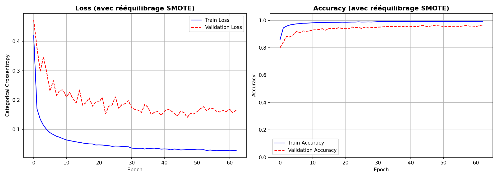

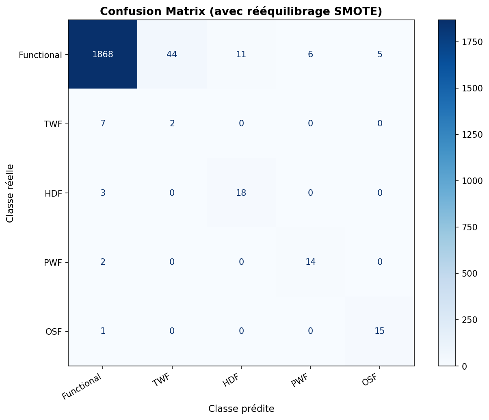

Le rééquilibrage a corrigé le défaut principal. Les recalls par classe :

| Classe | Recall sans SMOTE | Recall avec SMOTE |
|--------|-------------------|-------------------|
| Functional | ~1.00 | 0.97 |
| TWF | 0.00 | 0.22 |
| HDF | 0.81 | 0.86 |
| PWF | 0.75 | 0.88 |
| OSF | 0.95 | 0.94 |

TWF passe de 0.00 à 0.22, ce qui reste faible mais au moins le modèle a commencé à apprendre une signature pour cette panne. HDF et PWF s'améliorent nettement. OSF reste stable.

Le compromis, c'est que 66 machines fonctionnelles sont maintenant classées à tort comme défaillantes (contre 8 avant), ce qui fait baisser l'accuracy globale à environ 96%. En contexte industriel, c'est un compromis acceptable : une inspection inutile coûte beaucoup moins cher qu'une panne non détectée. C'est mieux de prédire une fausse panne que de rater une vraie.

---

## 7. Export et conversion du modèle

Le modèle est exporté au format TFLite (`.tflite`) plutôt qu'en `.h5`. Ce n'était pas mon premier choix : initialement j'exportais en .h5, qui est le format natif de Keras. Mais j'ai découvert que Keras 3 ajoute un attribut `quantization_config` dans chaque couche Dense lors de la sauvegarde en .h5, et X-CUBE-AI (v10) ne sait pas le lire. L'import dans CubeMX plante avec une erreur de désérialisation pas très explicite. J'ai perdu un bon moment là-dessus avant de comprendre que le problème venait du format et pas du modèle lui-même (j'en reparle dans la section [Problèmes rencontrés](#10-problèmes-rencontrés-et-bugs)).

Le format TFLite contourne ce problème car il a son propre format de sérialisation, indépendant de Keras.

Fichiers exportés :
- `modele/modele_maintenance.tflite` : le modèle converti (15.6 KB)
- `modele/x_test.npy` : données de test (1996 échantillons, 8 features normalisées)
- `modele/y_test.npy` : labels one-hot (1996 échantillons, 5 classes)

---

## 8. Déploiement sur STM32L4R9

### 8.1 Configuration X-CUBE-AI

Le modèle TFLite a été importé dans STM32CubeMX via le middleware X-CUBE-AI. La configuration :

- **Nom du réseau :** `ai4i` (ce nom est utilisé partout dans le code C généré : `ai_ai4i_create_and_init`, `ai_ai4i_run`, etc.)
- **Compression :** none — le modèle fait 12 Ko de poids, il n'y a aucun intérêt à compresser
- **Options :** `allocate-inputs` et `allocate-outputs` activées — les buffers d'entrée/sortie sont alloués dans le buffer d'activations au lieu d'être déclarés séparément, ce qui économise un peu de RAM

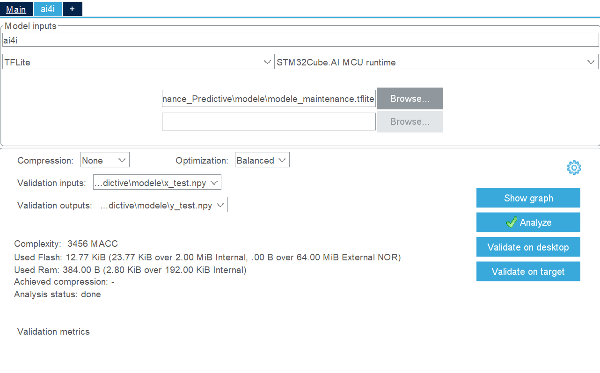

### 8.2 Analyse du modèle

Avant de générer le code, X-CUBE-AI analyse le modèle pour vérifier qu'il tiendra dans les contraintes mémoire de la cible. Résultats complets dans `stm32/rapport-analyse.txt`.

| Métrique | Valeur |
|----------|--------|
| Paramètres | 3 269 (12.77 KiB) |
| MACC (opérations multiply-accumulate) | 3 456 |
| Poids (FLASH, lecture seule) | 13 076 B (12.77 KiB) |
| Activations (RAM, lecture-écriture) | 384 B |
| Entrée | float32(1×8), 32 B |
| Sortie | float32(1×5), 20 B |
| **FLASH totale (modèle + runtime)** | **23 700 B (23.14 KiB)** |
| **RAM totale** | **2 868 B (2.80 KiB)** |

#### Graphe du modèle

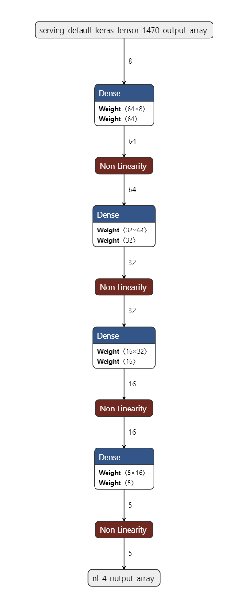

Ce graphe est généré par X-CUBE-AI et représente le pipeline d'inférence tel qu'il sera exécuté sur la STM32. L'entrée (`serving_default_keras_tensor_1470_output_array`) est un vecteur de 8 float32 — nos 8 features normalisées.

Ce qu'on voit, c'est que chaque couche Dense qu'on a définie dans Keras est décomposée en deux opérations distinctes par le runtime : un bloc **Dense** (la multiplication matricielle + biais) suivi d'un bloc **Non Linearity** (la fonction d'activation). Dans Keras on écrit `Dense(64, activation='relu')` et ça a l'air d'être une seule chose, mais côté exécution C c'est bien deux étapes séparées. Les trois premières non-linéarités sont des ReLU, la dernière (`nl_4`) est le softmax qui produit les probabilités de sortie.

Pour chaque couche Dense, le graphe affiche les dimensions des poids : la matrice (sortie × entrée) et le vecteur de biais. La première couche a une matrice 64×8 = 512 poids + 64 biais. La deuxième (32×64 = 2 048 poids + 32 biais) est de loin la plus lourde du réseau. Les couches suivantes sont de plus en plus petites, ce qui reflète la stratégie de compression progressive vers les 5 classes de sortie : 8 → 64 → 32 → 16 → 5. On élargit d'abord la représentation pour capturer des combinaisons de features, puis on la réduit progressivement jusqu'à l'espace de classification.

La sortie finale (`nl_4_output_array`) est un vecteur de 5 valeurs : les probabilités pour Functional, TWF, HDF, PWF, OSF.

#### Memory layout

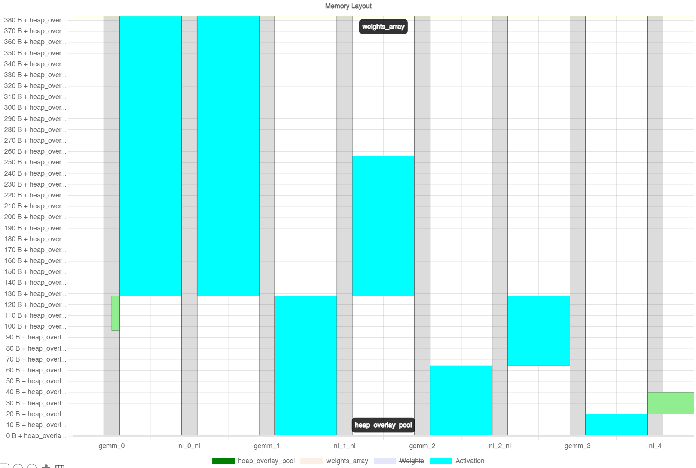

Ce diagramme est probablement le plus intéressant des deux, mais il est aussi moins intuitif à lire. Il montre comment la RAM est utilisée à chaque étape de l'inférence.

L'axe horizontal représente les opérations exécutées séquentiellement, de gauche à droite : `gemm_0`, `nl_0_nl`, `gemm_1`, `nl_1_nl`, `gemm_2`, `nl_2_nl`, `gemm_3`, `nl_4`. Les `gemm` correspondent aux couches Dense (multiplication matricielle) et les `nl` aux fonctions d'activation. L'axe vertical représente les adresses mémoire en octets, relatives au début du pool d'activations.

Les zones cyan représentent les **activations**, c'est-à-dire les buffers temporaires qui contiennent les tenseurs intermédiaires (les vecteurs de sortie de chaque couche). On voit que les premières étapes (`gemm_0`, `gemm_1`) ont les colonnes les plus hautes : c'est logique, on y manipule les vecteurs les plus larges (64 float32 = 256 octets). À partir de `gemm_2` la hauteur diminue parce que les vecteurs passent à 32 puis 16 valeurs. À `nl_4` (la dernière activation, le softmax), l'empreinte est minimale puisqu'on ne travaille plus que sur 5 valeurs.

La bande `weights_array` en haut du diagramme représente les poids du réseau. En réalité ils sont stockés en Flash (lecture seule, 13 Ko) et pas en RAM, mais le diagramme montre leur emplacement logique dans l'espace d'adressage du runtime. On voit qu'ils sont accédés par chaque opération `gemm` mais pas par les `nl` — ce qui est normal puisque les fonctions d'activation n'ont pas de paramètres appris, elles appliquent juste une fonction mathématique sur les valeurs en place.

Le point le plus important de ce diagramme, c'est le mécanisme d'**overlay mémoire** (visible via le `heap_overlay_pool`). X-CUBE-AI ne va pas allouer un buffer séparé pour chaque tenseur intermédiaire — ça demanderait 64+32+16+5 = 117 floats = 468 octets rien que pour les activations. À la place, il réutilise les mêmes zones de RAM pour des tenseurs qui n'ont pas besoin de coexister en même temps. Quand `gemm_1` s'exécute, le buffer de sortie de `gemm_0` a déjà été consommé par `nl_0_nl` et peut être écrasé. C'est grâce à ce mécanisme que le budget total d'activations n'est que de **384 octets** alors que la somme brute de tous les tenseurs intermédiaires serait bien supérieure. Concrètement, c'est une allocation/désallocation dynamique au sein d'un buffer statique de taille fixe, ce qui est typique de l'embarqué où on veut éviter le `malloc` à tout prix.

#### Observations générales

La STM32L4R9 dispose de 2 Mo de Flash et 640 Ko de RAM. Mon modèle occupe 23 Ko en Flash et 2.8 Ko en RAM, soit environ 1% des ressources disponibles. C'est rassurant, mais ça montre aussi qu'on aurait largement pu se permettre un réseau plus gros si les performances l'avaient justifié.

Le nombre de MACC (3 456) est très faible. Pour donner un ordre de grandeur, un petit réseau de classification d'images c'est plusieurs millions de MACC. Ici l'inférence prend environ 0.002 ms sur le host en validation desktop, et c'est quasi-instantané sur la carte. Normal : on ne fait que 4 multiplications matricielles sur 8 features.

En regardant la répartition par couche (confirmée visuellement par le memory layout), la couche Dense 64→32 concentre à elle seule 61.1% des opérations et 63.6% de la mémoire poids. C'est attendu : c'est la couche avec le plus de connexions (64 × 32 = 2 048 poids). Si on devait optimiser la taille ou la vitesse du modèle, c'est cette couche qu'il faudrait cibler en premier.

J'ai laissé la compression à "none" car le modèle fait déjà 12 Ko de poids. La quantification int8 diviserait la taille par ~4, mais vu la marge mémoire, ça n'apporterait rien de concret et pourrait dégrader la précision des sorties softmax.

### 8.3 Validation sur desktop

Avant de flasher le modèle sur la carte, X-CUBE-AI permet de le valider "on desktop" : le code C généré est compilé et exécuté directement sur le PC avec les données de test. Ça permet de vérifier que la conversion TFLite → C n'a pas cassé quelque chose. Résultats dans `stm32/rapport-validation-desktop.txt`.

| Modèle | Accuracy | RMSE |
|--------|----------|------|
| Modèle TFLite original | 96.04% | 0.1138 |
| Modèle C généré (HOST) | 96.04% | 0.1138 |
| **Cross-accuracy (ref vs C)** | **100.00%** | 0.000000043 |

La cross-accuracy de 100% est le point important ici. Ça veut dire que le modèle C produit exactement les mêmes sorties que le modèle TFLite, à la précision flottante près (RMSE de 4.3×10⁻⁸, c'est du bruit numérique). Ce résultat est utile parce que si le modèle se comporte bizarrement une fois sur la carte, on sait que le problème ne vient pas de la conversion mais forcément de la communication UART ou du preprocessing des données.

La matrice de confusion de la validation desktop confirme la même répartition que Python :
- C0 (Functional) : 1868 corrects, 66 faux positifs de panne répartis sur les autres classes
- C1 (TWF) : seulement 2 détectés sur 9 — c'est la faiblesse connue du modèle
- C2 (HDF), C3 (PWF), C4 (OSF) : bien détectés globalement

### 8.4 Code embarqué : ce que j'ai écrit et pourquoi

X-CUBE-AI génère un squelette dans `app_x-cube-ai.c` avec des fonctions vides à remplir. Toute la logique que j'ai ajoutée se trouve dans les zones `USER CODE`. La carte n'a pas de capteurs industriels branchés, donc on utilise l'UART (port série via le câble ST-Link) pour envoyer les données depuis le PC et récupérer les prédictions.

Le protocole d'échange entre le PC et la carte est illustré ci-dessous :

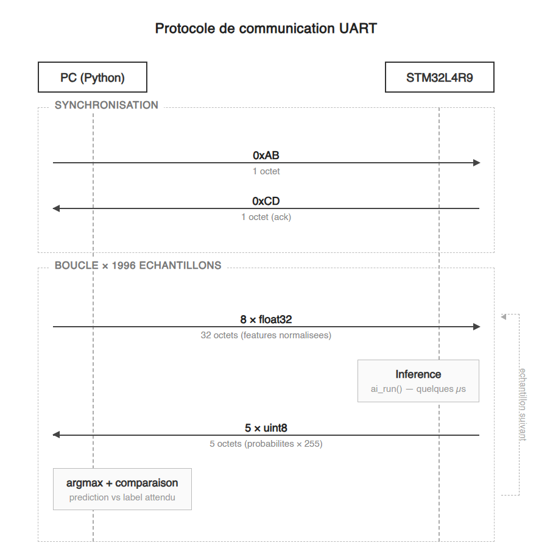

En résumé : le PC envoie `0xAB`, la carte répond `0xCD` (synchronisation), puis on boucle — le PC envoie 32 octets (8 float32), la carte fait l'inférence et renvoie 5 octets (les probabilités en uint8). Le code ci-dessous détaille chaque étape.

#### Constantes et configuration

```c
extern UART_HandleTypeDef huart2;
#define INPUT_SIZE 8       // 8 float32 inputs
#define INPUT_BYTES (INPUT_SIZE * 4)  // 8 × 4 = 32 octets
#define OUTPUT_SIZE 5      // 5 classes en sortie
#define UART_TIMEOUT 5000
#define SYNC_BYTE 0xAB
#define ACK_BYTE 0xCD
```

`huart2` est déclaré en `extern` parce qu'il est défini dans `main.c` par le code généré par CubeMX. C'est l'UART2 qui correspond au Virtual COM Port du ST-Link — c'est par là que transitent toutes les données.

Le timeout de 5000 ms est volontairement large. Au début j'avais mis 1000 ms, mais il arrivait que le script Python soit un peu lent à envoyer les données (surtout au premier échantillon après la synchro), et la carte partait en timeout. 5 secondes c'est confortable sans être bloquant.

#### Synchronisation UART

```c
void uart_sync(void)
{
    uint8_t rx = 0;
    uint8_t ack = ACK_BYTE;
    while (rx != SYNC_BYTE)
    {
        HAL_UART_Receive(&huart2, &rx, 1, HAL_MAX_DELAY);
    }
    HAL_UART_Transmit(&huart2, &ack, 1, UART_TIMEOUT);
}
```

Sans cette étape, la carte commencerait à lire des octets dès le démarrage sans savoir si le script Python tourne, et tout serait désynchronisé. J'ai choisi `HAL_MAX_DELAY` (attente infinie) plutôt qu'un timeout parce que tant que le PC n'a pas lancé le script, la carte n'a rien d'autre à faire. C'est basique, mais ça marche.

#### Réception des données d'entrée

```c
int acquire_and_process_data(ai_i8* data[])
{
    HAL_StatusTypeDef status = HAL_UART_Receive(
        &huart2,
        (uint8_t *)data[0],
        INPUT_BYTES,
        UART_TIMEOUT
    );
    if (status != HAL_OK)
        return -1;
    return 0;
}
```

Un point important ici : on écrit directement dans `data[0]`, qui est le pointeur vers le buffer d'entrée du réseau de neurones. On n'utilise pas de buffer intermédiaire. C'est possible parce que les données arrivent déjà au bon format (8 float32 normalisés, envoyés en little-endian par Python, ce qui est aussi l'endianness de l'ARM Cortex-M4).

Ce `data[0]` pointe soit vers un buffer statique, soit vers une zone dans le buffer d'activations (si `allocate-inputs` est activé). Dans notre cas c'est le buffer d'activations, ce qui veut dire que ce pointeur n'est valide qu'après l'appel à `ai_boostrap()`. Si on essaie d'écrire dedans avant, on écrit à l'adresse NULL. C'est un piège que j'ai découvert de manière un peu douloureuse (le firmware crashait silencieusement au premier échantillon reçu).

#### Envoi des résultats

```c
int post_process(ai_i8* data[])
{
    ai_float *output = (ai_float *)data[0];
    uint8_t results[OUTPUT_SIZE];

    for (int i = 0; i < OUTPUT_SIZE; i++)
    {
        results[i] = (uint8_t)(output[i] * 255.0f);
    }

    HAL_StatusTypeDef status = HAL_UART_Transmit(
        &huart2,
        results,
        OUTPUT_SIZE,
        UART_TIMEOUT
    );
    if (status != HAL_OK)
        return -1;
    return 0;
}
```

Les sorties du réseau sont 5 float32 (les probabilités softmax). Je les convertis en uint8 en multipliant par 255 avant de les envoyer. On passe de 20 octets à 5 octets par inférence. Pour notre petit projet la différence n'est pas énorme, mais c'est un pattern qu'on retrouve souvent en embarqué quand on veut limiter le volume de données sur le bus série.

La résolution de la conversion est de 1/255 ≈ 0.4%. En pratique, ça veut dire que deux classes séparées par moins de 0.4% de probabilité pourraient être inversées par l'arrondi. Mais pour de la classification, on prend l'argmax (la classe avec la plus grande probabilité), et les probabilités du softmax sont généralement assez tranchées. Sur les 1996 tests, cette perte de précision n'a affecté aucune prédiction.

#### Boucle principale

```c
void MX_X_CUBE_AI_Process(void)
{
    int res = -1;
    uart_sync();

    if (ai4i) {
        do {
            res = acquire_and_process_data(data_ins);
            if (res == 0)
                res = ai_run();
            if (res == 0)
                res = post_process(data_outs);
        } while (res == 0);
    }
}
```

La boucle est volontairement linéaire : réception → inférence → envoi, en série. Pas de DMA, pas d'interruptions. C'est suffisant ici parce que le temps d'inférence est négligeable (quelques microsecondes) et que le bottleneck est de toute façon le débit UART à 115200 baud. Si une des étapes échoue (timeout UART, erreur réseau), `res` passe à -1 et la boucle s'arrête. Dans un vrai système industriel il faudrait gérer les erreurs de façon plus fine (retry, log, watchdog), mais pour du test c'est suffisant.

Le `if (ai4i)` vérifie que le réseau a été correctement initialisé par `ai_boostrap()`. Si `ai_ai4i_create_and_init` avait échoué (modèle corrompu, pas assez de RAM), `ai4i` serait `AI_HANDLE_NULL` et on n'entrerait pas dans la boucle.

### 8.5 Côté PC : le script de communication

Le script `scripts/communication.py` fait le miroir de ce qui se passe côté carte :

1. Il ouvre le port série (`COM3`, 115200 baud)
2. Il attend 2 secondes pour que la connexion s'établisse (sans ce délai, les premiers octets sont parfois perdus)
3. Il envoie `0xAB` et attend `0xCD`
4. Il boucle sur les 1996 échantillons de test : envoi de 8 float32, réception de 5 uint8, comparaison de l'argmax avec le label attendu

Le script affiche l'accuracy tous les 200 échantillons pour suivre la progression. À la fin, il donne le résultat global.

---

## 9. Résultats de l'inférence embarquée

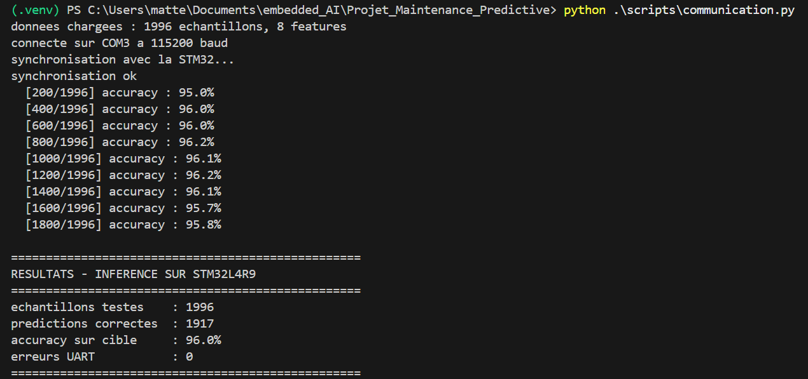

| Environnement | Accuracy |
|---------------|----------|
| Python (entraînement) | ~96% |
| Validation desktop X-CUBE-AI | 96.04% |
| **Inférence sur STM32L4R9** | **96.0%** |

L'accuracy sur cible est de **96.0%**, avec **0 erreur UART** sur les 1996 échantillons.

Ce résultat est cohérent avec la validation desktop (96.04%). La différence de 0.04% s'explique par la conversion float → uint8 → float qui introduit une erreur d'arrondi. En pratique, l'argmax est quasiment jamais affecté par une erreur de 0.4%.

Le fait que les 1996 inférences se soient déroulées sans aucune erreur UART confirme que le protocole de communication est fiable et que la carte exécute le modèle de façon stable. Le protocole est minimaliste (pas de checksum, pas de retry), mais sur une liaison USB-série courte et dans un environnement non bruité, ça suffit.

---

## 10. Problèmes rencontrés et bugs

Cette section documente les vrais problèmes que j'ai rencontrés pendant le projet, parce qu'ils ne sont pas toujours évidents et que ça peut éviter des heures de debug à quelqu'un qui ferait un projet similaire.

### Keras 3 et X-CUBE-AI : le piège du .h5

**Symptôme :** L'import du modèle `.h5` dans CubeMX via X-CUBE-AI échoue avec une erreur de désérialisation pas très lisible.

**Cause :** Depuis Keras 3, quand on sauvegarde un modèle en `.h5`, Keras ajoute automatiquement un attribut `quantization_config` dans les métadonnées de chaque couche Dense. Cet attribut n'existait pas dans Keras 2, et X-CUBE-AI v10 ne sait pas le parser. Le message d'erreur ne mentionne pas du tout `quantization_config`, ce qui rend le diagnostic difficile.

**Solution :** Exporter en TFLite plutôt qu'en .h5. Le format TFLite a sa propre sérialisation, indépendante de celle de Keras, et X-CUBE-AI le supporte correctement. C'est d'ailleurs le format recommandé par ST pour les modèles TensorFlow.

**Temps perdu :** Facilement 2 heures à chercher si le problème venait de mon modèle, de la version de TensorFlow, ou de X-CUBE-AI. La solution est tombée en lisant un thread sur le forum ST.

### SDMMC1 bloque le démarrage

**Symptôme :** Après avoir flashé le firmware, la carte ne fait rien. Pas de sortie UART, pas de réponse au script Python. Le debugger montre que le programme est bloqué dans `Error_Handler()`.

**Cause :** La carte STM32L4R9I-Discovery a un slot de carte SD. Par défaut, le périphérique SDMMC1 est activé dans le .ioc. Si aucune carte SD n'est insérée, `MX_SDMMC1_SD_Init()` retourne `HAL_ERROR`, et le code généré par CubeMX appelle `Error_Handler()` en cas d'erreur d'initialisation. Le programme reste bloqué dans une boucle infinie, avant même d'arriver à la logique d'inférence.

**Solution :** Désactiver le périphérique SDMMC1 directement dans le fichier `.ioc` via CubeMX, puis régénérer le code. L'appel à `MX_SDMMC1_SD_Init()` n'est plus généré.

**Ce qui m'a mis sur la piste :** En mettant un breakpoint dans `Error_Handler()` et en remontant la call stack, j'ai vu que ça venait de l'init SDMMC. C'est le genre de bug qui est évident une fois qu'on le sait, mais qui peut faire perdre du temps quand on ne connaît pas bien la carte.

### Buffers d'entrée/sortie et `allocate-inputs`

**Symptôme :** Le firmware crashe (HardFault) dès la première réception UART.

**Cause :** Avec les options `allocate-inputs` et `allocate-outputs`, les buffers d'entrée et de sortie ne sont pas des tableaux statiques déclarés à la compilation. Ce sont des pointeurs qui sont assignés pendant `ai_boostrap()`, quand le réseau est initialisé. Avant cet appel, `data_ins[0]` vaut `NULL`.

Si on essaie d'écrire les données reçues par UART dans `data_ins[0]` avant que `ai_boostrap()` n'ait été appelé, on écrit à l'adresse 0, ce qui provoque un HardFault.

**Solution :** S'assurer que `MX_X_CUBE_AI_Init()` (qui appelle `ai_boostrap()`) est bien exécuté avant `MX_X_CUBE_AI_Process()`. Dans le code généré par CubeMX, c'est normalement garanti par l'ordre des appels dans `main()`, mais si on réorganise le code ou si on ajoute de l'initialisation custom, il faut faire attention à cet ordre.

### Timeout UART trop court

**Symptôme :** L'inférence fonctionne pour quelques échantillons, puis la carte se désynchonise et les résultats deviennent n'importe quoi.

**Cause :** Au début j'avais mis un timeout de 1000 ms pour `HAL_UART_Receive`. Le script Python, selon la charge du PC, pouvait mettre un peu plus de temps à envoyer les 32 octets d'un échantillon (surtout en début de communication ou si d'autres processus tournaient). La carte partait en timeout, renvoyait -1, et la boucle d'inférence s'arrêtait.

**Solution :** Passer le timeout à 5000 ms. C'est large mais ça ne ralentit rien quand la communication est fluide (le timeout ne s'applique que si les données n'arrivent pas).

---

## 11. Limites du projet

Je préfère être transparent sur ce que ce projet ne fait pas ou fait mal :

### TWF reste mal détecté

Le recall de 0.22 sur TWF signifie qu'on ne détecte que 2 pannes sur 9 de ce type dans le test set. C'est un progrès par rapport au 0.00 du premier modèle, mais c'est insuffisant pour un usage réel. La raison est simple : il n'y a que ~34 exemples de TWF dans le training set. SMOTE génère des points synthétiques, mais ils sont interpolés entre des points qui sont eux-mêmes rares et potentiellement bruités. On ne peut pas demander au modèle de faire des miracles avec si peu de données.

### Pas de capteurs réels

Le modèle est testé avec des données envoyées depuis un PC, pas avec de vrais capteurs branchés sur la carte. Dans un déploiement réel, il faudrait gérer l'acquisition des capteurs (I2C, SPI, ADC...), le prétraitement en temps réel (normalisation avec la même moyenne et le même écart-type que le training set), et potentiellement le bruit de mesure.

### Pas de gestion d'erreur robuste

Le protocole UART n'a pas de checksum. Si un octet est corrompu pendant la transmission, la prédiction sera faussée sans qu'on le détecte. Sur les 1996 tests en USB-série direct, il n'y a eu aucune erreur. Mais dans un environnement industriel avec des câbles plus longs ou des interférences électromagnétiques, il faudrait ajouter au minimum un CRC8.

La boucle d'inférence s'arrête à la première erreur. Il n'y a pas de mécanisme de retry ou de watchdog. Pour du test c'est suffisant, mais en production il faudrait que la carte se resynchronise automatiquement après une erreur.

### Le softmax exclut les pannes simultanées

En utilisant softmax en sortie, le modèle ne peut prédire qu'une seule classe à la fois. Les cas (rares) où deux pannes surviennent simultanément ne sont pas gérés. Si c'était un besoin, il faudrait passer à des sigmoïdes indépendantes avec un seuil par classe, mais ça complique l'entraînement et le modèle devrait être plus gros.

---

## 12. Conclusion et pistes d'amélioration

Ce projet couvre la chaîne complète de la maintenance prédictive embarquée, de l'analyse d'un dataset industriel déséquilibré à l'inférence sur cible STM32L4R9 en passant par la gestion du déséquilibre par SMOTE, l'export TFLite, et la validation via X-CUBE-AI.

Le modèle est fonctionnel et détecte la majorité des types de pannes (HDF, PWF, OSF avec des recalls > 0.85). L'accuracy sur cible de 96.0% est cohérente avec la validation desktop, ce qui montre que la conversion et le déploiement n'ont pas dégradé les performances. Le protocole UART est fiable sur les 1996 tests effectués. Le modèle est très léger (23 Ko Flash, 2.8 Ko RAM), ce qui laisse de la marge pour un éventuel enrichissement.

Le point faible reste TWF (recall 0.22), et c'est un problème de données, pas d'architecture.

### Pistes d'amélioration

- **Plus de données pour TWF :** C'est clairement le facteur limitant. Plus de données réelles pour cette classe auraient un impact bien plus grand que n'importe quelle modification d'architecture ou d'hyperparamètres.
- **Quantification int8 :** Réduirait la taille Flash/RAM par ~4. Pas nécessaire sur la STM32L4R9, mais ça le deviendrait sur un micro plus contraint (STM32L0, STM32G0...).
- **CRC sur l'UART :** Ajouter un CRC8 à chaque échange permettrait de détecter les erreurs de transmission. Facile à implémenter des deux côtés.
- **Architecture alternative :** Un réseau avec BatchNormalization ou LeakyReLU pourrait améliorer la convergence sur les classes rares. J'ai pas testé ces pistes par manque de temps, mais c'est quelque chose à explorer.
- **Acquisition capteurs en temps réel :** Brancher de vrais capteurs (température, accéléromètre, etc.) sur la carte et faire de l'inférence en continu plutôt qu'en envoyant les données depuis un PC.

---

## 13. Bonus : reconnaissance de chiffres MNIST sur écran tactile

### L'idée

Le projet principal est terminé et fonctionne, mais il reste un truc un peu frustrant : la carte a un bel écran AMOLED tactile de 390×390 pixels, et on ne l'utilise pas du tout. En cours, le professeur nous avait fourni un petit CNN pour classifier les chiffres MNIST en classe, et la carte supporte le tactile capacitif. D'où l'idée : dessiner un chiffre au doigt sur l'écran, et laisser le modèle embarqué deviner de quel chiffre il s'agit (si je suis parfaitement honnête, le professeur nous l'a suggéré, un peu comme une bouteille à la mer). C'est une quête secondaire, le but c'est surtout de s'amuser et de voir ce qui se passe quand on confronte un modèle entraîné sur des données propres à des entrées dessinées à la main sur un écran tactile pas vraiment fait pour ça.

### Le modèle

Le modèle vient du notebook du prof (`bonus/CNN_C2_16_10/Embedded_AI_colab.ipynb`). C'est un petit CNN minimaliste :

| Couche | Détail |
|--------|--------|
| Conv2D | 2 filtres 3×3, padding same, ReLU |
| MaxPooling2D | 2×2 |
| Flatten | — |
| Dense | 16 neurones, ReLU |
| Dense (sortie) | 10 neurones, softmax |

Il atteint 95.8% d'accuracy sur le test set MNIST après 5 epochs. C'est honnête pour un réseau aussi petit (6 478 paramètres, 25 Ko de poids), mais c'est clairement pas un modèle de production — deux filtres de convolution, c'est le strict minimum pour extraire des features spatiales. En comparaison, un LeNet-5 classique a 6 couches et ~60 000 paramètres.

L'import du `.h5` dans X-CUBE-AI s'est fait sans problème cette fois (contrairement au projet principal, le bug Keras 3 / `quantization_config` n'affecte pas ce modèle). Le rapport d'analyse est dans `bonus/MnistNetwork/X-CUBE-AI/App/mnist_generate_report.txt` : 25.3 KiB de poids en Flash, 3.8 KiB d'activations en RAM, 23 874 MACC.

### Organisation des dossiers bonus

Le travail bonus est réparti en trois dossiers, chacun correspondant à une étape :

```
bonus/
├── CNN_C2_16_10/                        # Étape 1 : le modèle du cours
│   ├── Embedded_AI_colab.ipynb          # Notebook d'entraînement du CNN MNIST
│   ├── CNN_Mnist.py                     # Script Python équivalent au notebook
│   ├── MNIST_NN_C2_16_10.h5            # Modèle entraîné au format Keras (.h5)
│   ├── mnist.npz                        # Dataset MNIST complet
│   ├── MNIST_xtest_NN_C2_16_10.npy     # Données de test (images 28×28)
│   └── MNIST_ytest_NN_C2_16_10.npy     # Labels de test
│
├── MnistNetwork/                        # Étape 2 : projet CubeMX avec X-CUBE-AI
│   ├── MnistNetwork.ioc                 # Configuration CubeMX (UART + X-CUBE-AI)
│   ├── X-CUBE-AI/App/
│   │   ├── mnist.c / mnist.h            # Code C du réseau généré par X-CUBE-AI
│   │   ├── mnist_data*.c/h              # Poids et paramètres du modèle
│   │   ├── mnist_generate_report.txt    # Rapport d'analyse mémoire
│   │   └── app_x-cube-ai.c/h           # Squelette applicatif généré
│   └── Middlewares/ST/AI/               # Runtime X-CUBE-AI (headers + lib statique)
│
└── MnistTouchscreen/                    # Étape 3 : le projet final
    ├── Src/main.c                       # Code applicatif : dessin, inférence, affichage
    ├── X-CUBE-AI/App/                   # Fichiers AI copiés depuis MnistNetwork
    │   └── app_x-cube-ai.c/h           # Modifié pour exposer ai_run() et les buffers
    ├── Inc/, Src/                       # Headers et sources BSP (repris de l'exemple ST)
    └── STM32CubeIDE/                    # Projet Eclipse (.project, .cproject)
```

**`CNN_C2_16_10/`** contient le notebook fourni par le professeur, mais rédigé par Kévin Hector, post doctorant de l'école, et le modèle `.h5` entraîné. C'est le point de départ : on ne touche à rien dedans, on récupère juste le `.h5` pour le donner à X-CUBE-AI.

**`MnistNetwork/`** est le projet CubeMX qu'on a créé en cours pour importer le modèle dans X-CUBE-AI. C'est un projet STM32 classique avec UART, mais sans aucune gestion de l'écran. Son rôle dans le bonus, c'est uniquement de servir de source pour les fichiers générés par X-CUBE-AI (le code C du réseau, les poids, le runtime). On n'a pas besoin de le compiler tel quel — on copie ses fichiers AI dans le projet final.

**`MnistTouchscreen/`** est le projet qui tourne sur la carte. Il est basé sur l'exemple BSP de ST (qui gère l'écran, le tactile, le joystick), dans lequel on a intégré les fichiers X-CUBE-AI de MnistNetwork et réécrit le `main.c`.

### L'approche : repartir de l'exemple BSP

Le projet CubeMX qu'on avait commencé en cours (`bonus/MnistNetwork/`) avait X-CUBE-AI configuré, mais il manquait tout ce qui concerne l'écran : les périphériques DSI, LTDC, GFXMMU, DMA2D, le driver de l'IO expander MFX qui contrôle l'alimentation de l'écran, le driver tactile FT3267... Configurer tout ça manuellement dans CubeMX aurait été très fastidieux.

La solution beaucoup plus simple : repartir de l'**exemple BSP** fourni par ST dans le firmware package (`STM32Cube_FW_L4_V1.18.2/Projects/32L4R9IDISCOVERY/Examples/BSP/`). Ce projet a déjà tout ce qu'il faut : l'écran LCD fonctionne, le tactile est configuré, le joystick aussi. Il suffisait d'y ajouter X-CUBE-AI (en copiant les fichiers générés par le projet MnistNetwork) et de réécrire le `main.c` pour remplacer les démos BSP par notre logique MNIST.

Concrètement, le travail côté code se résume à :
- Copier le projet BSP dans `bonus/MnistTouchscreen/` et corriger les chemins relatifs des fichiers (le projet BSP utilise des liens vers le repository STM32Cube qui cassent quand on le déplace)
- Copier les fichiers X-CUBE-AI (modèle + runtime) depuis MnistNetwork
- Ajouter les include paths et la librairie statique AI au projet
- Réécrire `main.c` : interface de dessin, gestion du tactile, inférence, affichage du résultat
- Modifier `app_x-cube-ai.c` pour rendre `ai_run()` et les buffers accessibles depuis le main

Le code BSP d'initialisation hardware (clock, LCD, touch, MFX, interruptions) est repris quasi tel quel de l'exemple ST. Le travail "maison" c'est vraiment la partie applicative : le canvas de dessin, la grille 28×28, le preprocessing et l'appel au modèle.

### Ce qui ne marchait pas (et comment on a ajusté)

**Le tactile était saccadé.** Les premiers essais donnaient des gros points isolés au lieu de traits continus. Le problème venait du fait que le tactile passait par des interruptions MFX qui arrivent à une fréquence assez basse. La solution : passer en **polling continu** de `BSP_TS_GetState()` dans la boucle principale (~100 Hz), et tracer des lignes interpolées entre chaque paire de points successifs. Pour que le trait soit uniforme (pas de lignes fines entre les gros points), on dessine des cercles le long de la ligne plutôt qu'un simple `DrawLine`.

**Le modèle prédisait n'importe quoi.** Les premières inférences donnaient des résultats complètement aléatoires. En fait, les chiffres dessinés au doigt sur l'écran sont très différents des images MNIST sur lesquelles le modèle a été entraîné : MNIST a des traits anti-aliasés (valeurs graduelles entre 0 et 255), alors que notre grille 28×28 n'avait que du noir (0) ou du blanc (255), avec des traits trop fins. Deux corrections :
- **Épaissir les traits** dans la grille : un rayon de 2 cellules autour de chaque point touché, ce qui donne des traits de 3-4 pixels de large en 28×28, similaire à MNIST
- **Appliquer un flou gaussien 3×3** sur la grille avant l'inférence, pour simuler l'anti-aliasing qu'on trouve dans les données MNIST

**Le bouton SEL du joystick ne répondait pas.** Le bouton SEL est sur un GPIO direct, pas via le MFX comme les directions. Or le code ne vérifiait l'état du joystick que dans le handler MFX. Il a fallu sortir le check de SEL de ce bloc pour qu'il soit traité indépendamment.

**Les pourcentages ne s'affichaient pas.** Le projet utilise `--specs=nano.specs` qui désactive le support de `%f` dans `sprintf`. On est passé à un format `%d` avec conversion entière.

### Résultat

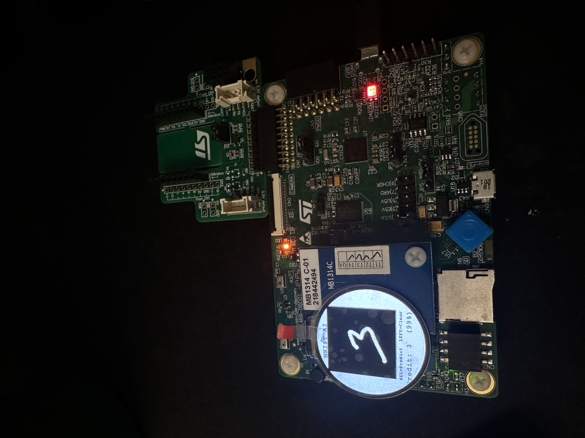

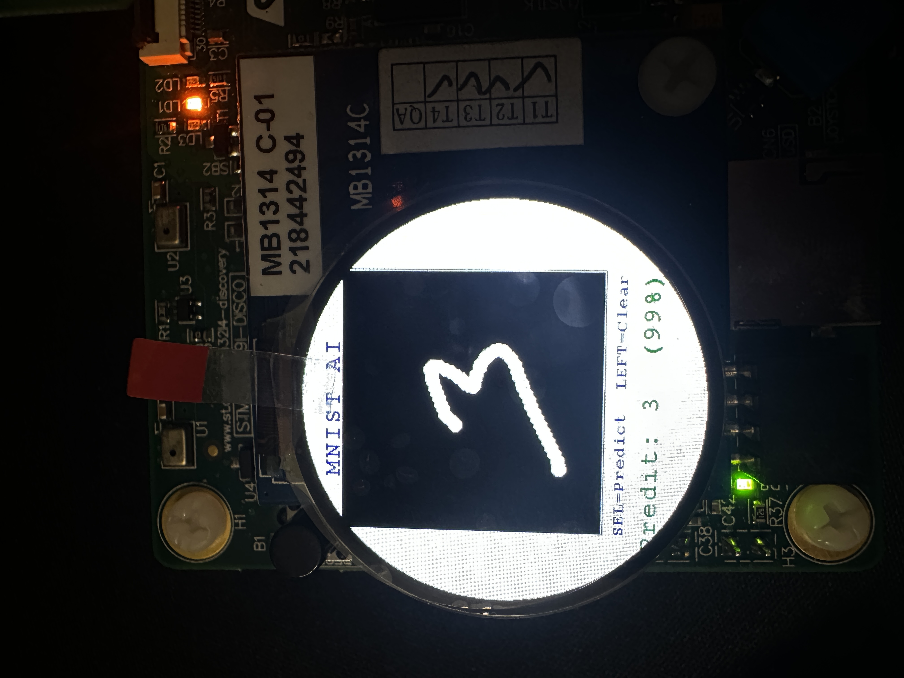

Ça marche... plus ou moins. Sur la photo ci-dessus, on voit un **3** reconnu avec **99% de confiance** ça fait rêver dit comme ça, mais il faut être honnête : c'est loin d'être comme ça à chaque fois. Pour obtenir ce résultat, j'ai dû m'appliquer à imiter la forme des chiffres tels qu'ils apparaissent dans le dataset MNIST, c'est-à-dire des traits arrondis, bien centrés, avec une certaine épaisseur. Ce n'est pas du tout comme ça que j'écris mes 3 naturellement.

Quand on dessine un chiffre bien gros, bien centré, avec des traits propres, le modèle le reconnaît assez souvent correctement. Les chiffres "faciles" sont le **0** (forme très distinctive), le **1** (un trait vertical) et le **7**. Les plus difficiles sont le **5** et le **8**, probablement parce qu'ils demandent des courbes précises que l'écran tactile ne capture pas très bien.

D'expérience, le taux de réussite dépend énormément de la façon dont on dessine. Si on trace lentement avec des traits épais et centrés, ça passe bien. Si on va vite ou qu'on dessine petit dans un coin, c'est beaucoup moins fiable. Au final ça montre bien qu'on peut arriver facilement à des petits résultats comme ça avec un modèle embarqué, mais que la vraie difficulté c'est le gap entre les données d'entraînement et les conditions réelles d'utilisation.

### Limites et analyse

Il faut être honnête : les performances sont assez moyennes en conditions réelles, et c'est dû à plusieurs facteurs cumulés.

**L'écran tactile n'est pas fait pour ça.** Le FT3267 est un contrôleur tactile capacitif correct, mais la résolution et la fréquence de polling ne sont pas celles d'une tablette graphique. Le doigt est un outil de pointage imprécis, et les événements tactiles arrivent avec une granularité qui crée inévitablement des discontinuités dans le trait, malgré l'interpolation.

**Le modèle est très petit.** Avec seulement 2 filtres de convolution, le CNN n'a quasiment pas de capacité à généraliser au-delà de la distribution exacte de MNIST. Les chiffres dessinés au doigt ont une esthétique différente (épaisseur variable, inclinaison, centrage approximatif), et le modèle n'a pas été entraîné pour gérer cette variabilité. Un modèle plus gros (genre LeNet-5 avec 6/16 filtres) serait probablement beaucoup plus robuste.

**Les données d'entrée sont très différentes de MNIST.** C'est le point fondamental. MNIST contient des chiffres scannés, nettoyés, centrés et normalisés. Nos chiffres dessinés au doigt n'ont aucun de ces traitements. Le flou gaussien aide un peu, mais on pourrait aller plus loin : centrer automatiquement le dessin dans la grille 28×28, normaliser l'épaisseur des traits, voire appliquer un morphological thinning.

### Ce qu'on pourrait améliorer

- **Un meilleur modèle** : entraîner un CNN plus profond (4-6 couches, 16-32 filtres) avec du data augmentation (rotation, translation, épaisseur variable) pour le rendre robuste aux variations de style d'écriture
- **Centrage automatique** : après le dessin, recentrer le contenu de la grille 28×28 pour que le chiffre soit au milieu, comme dans MNIST
- **Amincissement morphologique** : normaliser l'épaisseur des traits pour se rapprocher de la distribution MNIST
- **Polling tactile plus rapide** : réduire le délai de polling ou utiliser le DMA pour les transferts I2C

### En résumé

C'est un bonus qui était surtout là pour le fun et pour explorer les limites d'un modèle embarqué confronté à des données réelles. Le travail en lui-même était assez minime (l'essentiel de l'infrastructure BSP est repris de l'exemple ST, le modèle est celui du prof), mais c'est satisfaisant de voir un chiffre dessiné au doigt être reconnu par un CNN qui tourne sur un micro-contrôleur. Et quand ça marche pas, c'est instructif aussi : ça illustre bien à quel point la qualité et la distribution des données d'entrée comptent, parfois plus que l'architecture du modèle elle-même.

## Remerciements

Ce projet a une petite histoire personnelle derrière. Je l'avais raté l'année dernière, et c'est quelque chose que j'avais assez mal vécu, j'avais été vraiment déçu de moi. En m'y replongeant cette année, je me suis rendu compte que j'étais totalement à côté de la plaque la première fois, je n'avais pas compris les enjeux du tout. Sans dire que l'IA embarquée est devenue une passion, j'ai pris beaucoup plus de plaisir cette année, et le projet m'a sincèrement beaucoup apporté.

Merci à mon professeur d'IA embarquée, qui a su me donner de bons conseils suite à cet échec. C'est grâce à ses retours que j'ai abordé le projet différemment cette année.

Merci aussi à un ami, qui préfère rester anonyme, qui m'a aidé sur la partie bonus pour adapter le projet BSP à mon cas d'usage. Sans son coup de main, la quête secondaire MNIST aurait probablement pas vu le jour.

Pour la partie bonus justement, je l'ai faite parce que ça me faisait plaisir, et la simple satisfaction d'avoir réussi à faire tourner ça sur la carte est déjà très enrichissante en soi.

---

## Auteur

Matteo Quintaneiro | Mines Saint-Étienne, 2026
