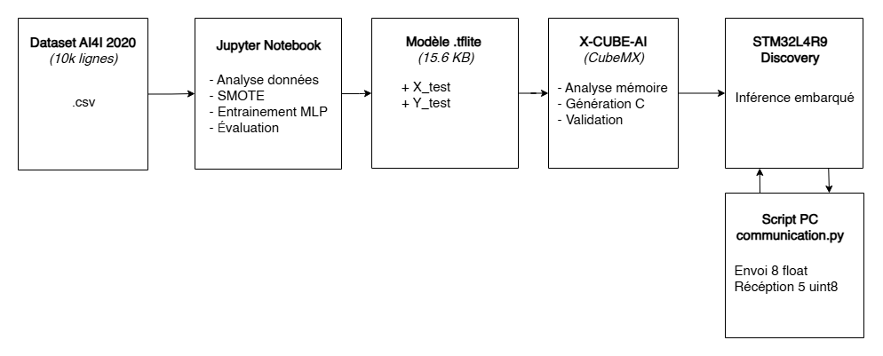
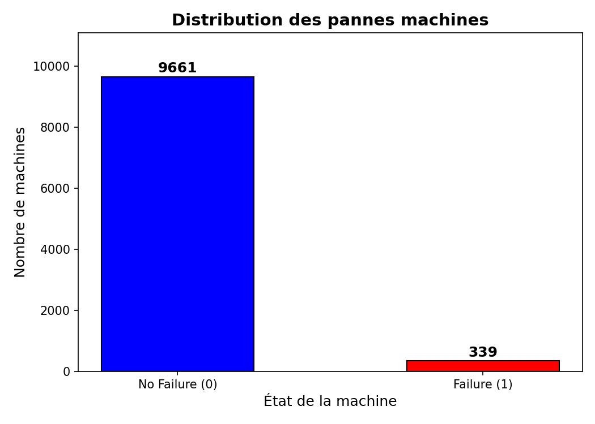
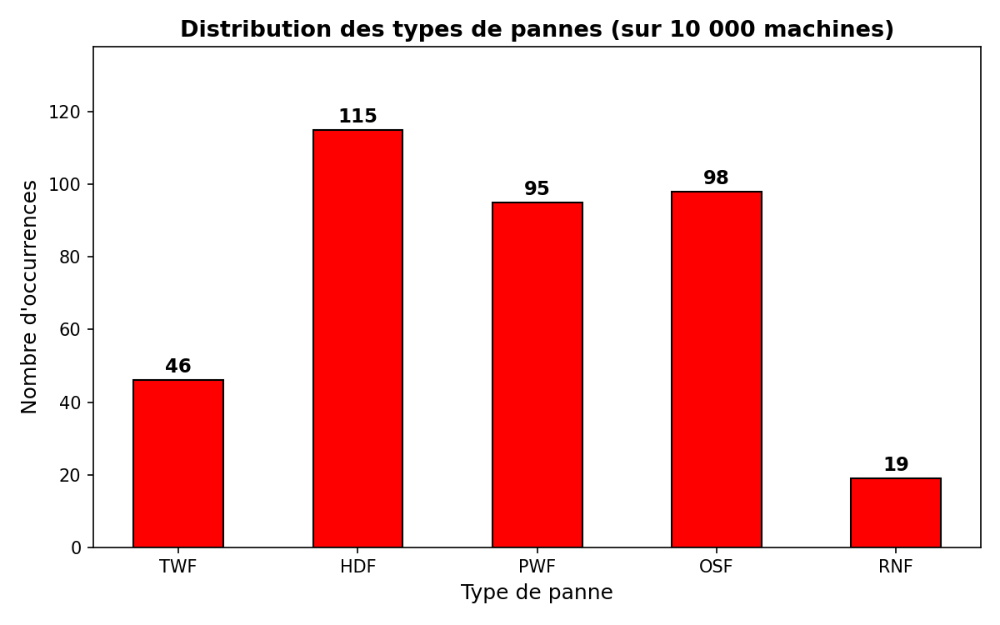
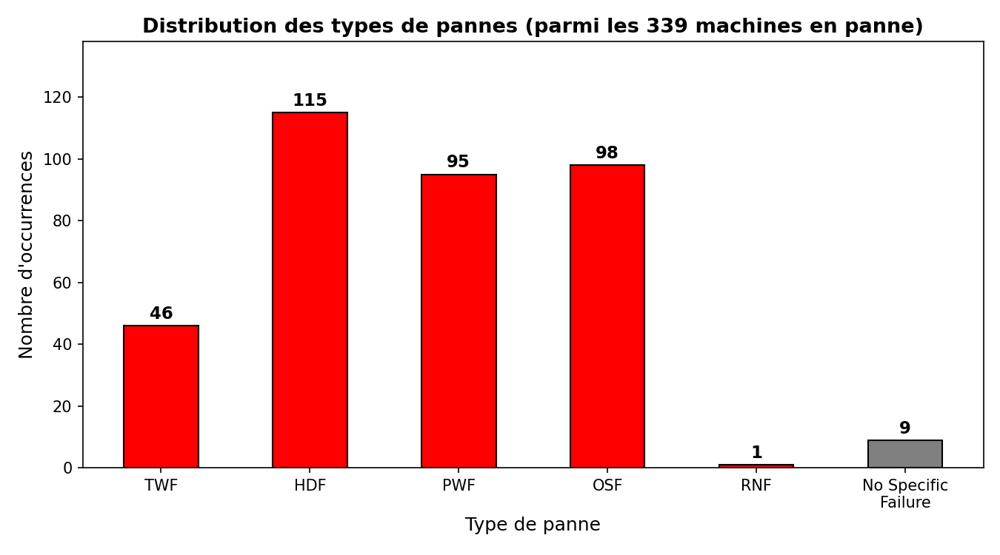

# Maintenance Prédictive par IA Embarquée sur STM32L4R9

## Table des matières

1. [Contexte et objectif](#1-contexte-et-objectif)
2. [Structure du dépôt](#2-structure-du-dépôt)
3. [Installation et utilisation](#3-installation-et-utilisation)

---

## 1. Contexte et objectif

En industrie, on a généralement trois façons de gérer la maintenance d'une machine : attendre qu'elle casse (maintenance corrective, coûteux et potentiellement dangereux), la réviser à intervalles fixes (maintenance préventive, on remplace des pièces qui auraient pu durer encore longtemps), ou analyser les données de ses capteurs pour détecter les signes avant-coureurs d'une panne et intervenir au bon moment (maintenance prédictive). C'est cette troisième approche qu'on met en oeuvre ici.

L'idée du projet, c'est de prendre un dataset de capteurs industriels (températures, couple, vitesse de rotation, usure d'outil), d'entraîner un réseau de neurones à classifier l'état d'une machine parmi 5 catégories (fonctionnelle + 4 types de pannes), puis de déployer ce modèle sur un microcontrôleur STM32L4R9. 

Ce déploiement sert à montrer que l'inférence tourne en embarqué, avec 23 Ko de Flash et 2.8 Ko de RAM, via l'outil X-CUBE-AI de STMicroelectronics.

Le schéma ci-dessous résume le pipeline complet du projet, du dataset brut jusqu'au test d'inférence sur cible :



---

## 2. Structure du dépôt

```
Projet_Maintenance_Predictive/
│
├── notebook/
│   └── TP_IA_EMBARQUEE.ipynb      # Notebook principal : analyse, entraînement, export
│
├── data/
│   └── ai4i2020.csv               # Dataset AI4I 2020 (10 000 échantillons)
│
├── modele/
│   ├── modele_maintenance.tflite   # Modèle entraîné, prêt à déployer (15.6 KB)
│   ├── x_test.npy                  # Données de test (1996 × 8 features normalisées)
│   └── y_test.npy                  # Labels one-hot (1996 × 5 classes)
│
├── scripts/
│   └── communication.py            # Script UART pour tester l'inférence sur cible
│
├── stm32/
│   ├── AI4I2020/                   # Projet STM32CubeIDE complet
│   │   ├── Core/Src/main.c         # Initialisation carte (UART, horloges, etc.)
│   │   ├── X-CUBE-AI/App/
│   │   │   └── app_x-cube-ai.c    # Code utilisateur : réception UART + inférence + envoi
│   │   └── AI4I2020.ioc            # Configuration CubeMX (périphériques, X-CUBE-AI)
│   ├── rapport-analyse.txt         # Rapport d'analyse mémoire du modèle
│   └── rapport-validation-desktop.txt  # Rapport de validation desktop (cross-accuracy)
│
├── images/                         # Graphiques et captures d'écran pour ce README
├── requirements.txt                # Dépendances Python
└── README.md                       # Ce fichier
```

**Fichiers clés à regarder en priorité :**
- Le notebook `notebook/TP_IA_EMBARQUEE.ipynb` contient toute la logique d'entraînement, de l'analyse des données à l'export du modèle.
- Le fichier `stm32/AI4I2020/X-CUBE-AI/App/app_x-cube-ai.c` contient le code que j'ai écrit pour faire communiquer la carte avec le PC et lancer l'inférence.
- Le script `scripts/communication.py` est ce qu'on exécute côté PC pour envoyer les données de test et récupérer les prédictions.

---

## 3. Installation et utilisation

### Prérequis

- Python 3.10+
- STM32CubeIDE (pour compiler et flasher le firmware)
- X-CUBE-AI v10.x (installé via le gestionnaire de packs dans CubeMX)
- Une carte STM32L4R9I-Discovery branchée en USB via le ST-Link

### Installation des dépendances Python

```bash
pip install -r requirements.txt
```

### Reproduire l'entraînement

Ouvrir `notebook/TP_IA_EMBARQUEE.ipynb` et exécuter toutes les cellules. Le notebook va :
1. Charger et analyser le dataset `data/ai4i2020.csv`
2. Entraîner deux modèles (avec et sans SMOTE)
3. Exporter le modèle final en `.tflite` dans `modele/`
4. Sauvegarder les données de test (`x_test.npy`, `y_test.npy`)

### Compiler et flasher le firmware

1. Ouvrir le projet `stm32/AI4I2020/` dans STM32CubeIDE
2. Build (Ctrl+B)
3. Flash via le ST-Link (Run → Debug ou Run)

### Tester l'inférence sur cible

Une fois le firmware flashé et la carte branchée :

```bash
python scripts/communication.py
```

Le script va se synchroniser avec la carte, envoyer les 1996 échantillons de test un par un, et afficher l'accuracy finale. Il faut vérifier que le port COM est le bon (par défaut `COM3`, visible dans le Gestionnaire de périphériques Windows sous "Ports (COM et LPT)").

---

## 4. Analyse du dataset AI4I 2020

Le dataset utilisé est le [AI4I 2020 Predictive Maintenance Dataset](https://archive.ics.uci.edu/ml/datasets/AI4I+2020+Predictive+Maintenance+Dataset). Il contient 10 000 échantillons de données de capteurs industriels simulés. Chaque ligne représente l'état d'une machine à un instant donné, avec des mesures physiques (températures, vitesse de rotation, couple, usure de l'outil) et des étiquettes indiquant si une panne est survenue, et de quel type.

### Déséquilibre des classes

Le premier truc qu'on remarque quand on regarde les données, c'est que la très grande majorité des machines fonctionnent normalement : environ 96.6% sont étiquetées "No Failure", et seulement 3.4% sont en panne.



Ce déséquilibre est tout à fait réaliste (heureusement qu'il y a plus de machines qui marchent que de machines cassées), mais ça pose un vrai problème pour l'entraînement. Un modèle peut très bien atteindre 96.6% d'accuracy en répondant systématiquement "pas de panne" à tout, sans avoir rien compris aux données. C'est exactement ce qui va se passer avec le premier modèle, on le verra plus bas.

### Types de pannes

Parmi les machines en panne, on distingue 5 types de défaillance :

| Sigle | Type de panne | Description |
|-------|--------------|-------------|
| TWF | Tool Wear Failure | Usure de l'outil |
| HDF | Heat Dissipation Failure | Dissipation thermique insuffisante |
| PWF | Power Failure | Panne liée à la puissance |
| OSF | Overstrain Failure | Surcharge mécanique |
| RNF | Random Failure | Panne aléatoire |





HDF et OSF sont les plus fréquents. TWF est déjà assez rare. Et RNF ne compte que 19 occurrences sur 10 000 lignes. Avec si peu d'exemples, aucun modèle ne pourra apprendre quelque chose de fiable pour cette classe. J'ai donc fait le choix de retirer RNF des sorties du modèle : on ne cherche pas à la prédire.

### Choix des entrées et sorties

J'ai pas mal réfléchi à ce qu'il fallait donner en entrée au modèle. Les 5 mesures capteurs brutes (Air temperature, Process temperature, Rotational speed, Torque, Tool wear) sont un bon point de départ, mais en regardant les corrélations dans les données, j'ai ajouté deux features calculées :

**8 entrées au total :**
- Les 5 mesures capteurs directes
- Le type de machine (encodé numériquement : L=0, M=1, H=2)
- `Power = Torque × Rotational speed` — corrélé aux pannes OSF et PWF, ce qui est logique physiquement (une puissance anormale signale une surcharge ou un problème électrique)
- `delta_T = Process temperature - Air temperature` — un bon indicateur pour HDF puisque c'est directement lié à la dissipation thermique

**5 sorties (softmax) :** Functional, TWF, HDF, PWF, OSF.

Le choix du **softmax** plutôt que des sigmoïdes indépendantes (approche multi-label) vient d'une observation dans les données : les pannes simultanées sont très rares, moins de 5% des cas de panne. Avec un softmax, le modèle est forcé de choisir une seule classe, ce qui simplifie l'apprentissage et donne des probabilités plus tranchées en sortie. En contrepartie, on perd la capacité de détecter les cas rares où deux pannes surviennent en même temps, mais c'est un compromis qui m'a semblé raisonnable vu les données.

---

## Auteur

Matteo Quintaneiro | Mines Saint-Étienne, 2026
